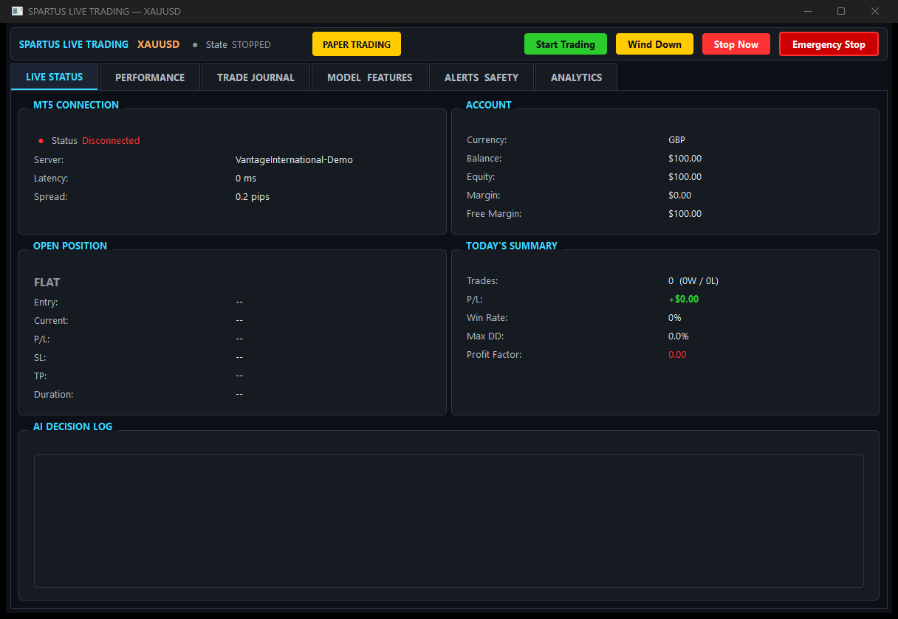
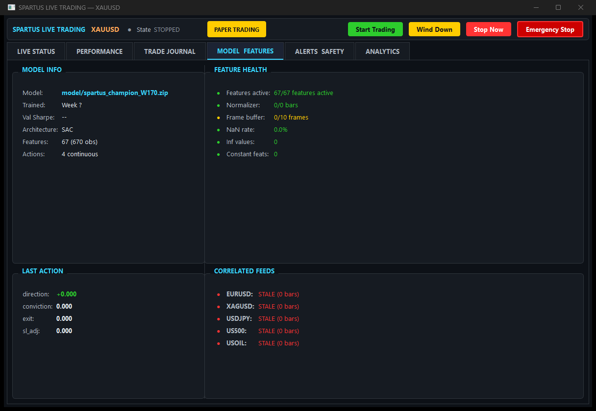

# Spartus Live Trading Dashboard

**AI-powered autonomous trading system for XAUUSD (Gold) on MetaTrader 5.**

Built on deep reinforcement learning (Soft Actor-Critic), Spartus processes 67 real-time features across technical analysis, correlated instruments, economic events, market microstructure, and regime detection -- then executes trades with multi-layered risk management through a professional PyQt6 dashboard.

### Live Status -- Real-time trading overview


### Model & Features -- AI model health and correlated instrument feeds


---

## What It Does

Spartus is a complete live trading pipeline. It connects directly to MetaTrader 5, computes features in real-time, runs inference through a trained SAC neural network, and manages the full trade lifecycle -- from entry to dynamic stop-loss management to exit.

### Core Capabilities

**Reinforcement Learning Engine**
- Soft Actor-Critic (SAC) policy with 4 continuous action outputs:
  - **Direction** [-1, +1] -- short to long conviction
  - **Position sizing** [0, 1] -- risk-scaled lot calculation
  - **Exit urgency** [0, 1] -- when to close the position
  - **Stop-loss management** [0, 1] -- dynamic SL tightening
- 670-dimensional observation space (67 features x 10 frame stack)
- Trained on years of M5 XAUUSD data with anti-leakage guarantees

**67 Real-Time Features (9 groups)**

| Group | Features | Description |
|---|---|---|
| **Technical Indicators** | 25 | RSI, MACD, Bollinger Bands, ADX, ATR, Stochastic, OBV, fractional differencing, multi-timeframe (M5/H1/H4/D1) |
| **Correlated Instruments** | 11 | EURUSD, XAGUSD, USDJPY, US500, USOIL returns + RSI + trend + gold/silver ratio |
| **Economic Calendar** | 6 | NFP/FOMC proximity, event windows, London Fix, COMEX session |
| **Spread & Liquidity** | 2 | Normalised spread, volume spikes |
| **Regime Detection** | 2 | Rolling gold-USD and gold-SPX correlations |
| **Session Microstructure** | 4 | Asian range, session momentum, London/NY overlap |
| **Time & Session** | 4 | Hour-of-day (sin/cos), day-of-week, session encoding |
| **Account State** | 8 | Equity ratio, position exposure, unrealised P&L, hold duration, daily trade count |
| **Trading Memory** | 5 | Win streak, recent P&L, prediction accuracy, trend alignment |

**Multi-Layered Safety System**
- Per-trade risk cap (default 2% of equity)
- Daily drawdown halt (3%) with automatic position closure
- Weekly drawdown limit (5%)
- Total drawdown circuit breaker (10%)
- Consecutive loss pause (3 losses = 30 min cooldown)
- Severe loss halt (5 losses = 2 hour halt)
- Friday position closure and weekend trade blocking
- Emergency stop button (closes all positions instantly)
- Paper trading mode for risk-free validation

**6-Tab Professional Dashboard**

| Tab | What You See |
|---|---|
| **Live Status** | Current position, real-time P&L, model action outputs, MT5 connection health, account balance |
| **Performance** | Equity curve chart, win rate, profit factor, average trade duration, Sharpe ratio, trade distribution |
| **Trade Journal** | Complete trade history with entry/exit prices, P&L, hold duration, trade classification |
| **Model & Features** | Live feature values, normaliser buffer health, feature drift detection with colour-coded alerts |
| **Alerts & Safety** | Circuit breaker status, drawdown meters, consecutive loss tracker, system warnings |
| **Analytics** | Correlation drift monitoring, action distribution analysis, weekly performance reports, retrain triggers |

---

## Architecture

```
MetaTrader 5                  Spartus Dashboard
+------------------+          +------------------------------------------+
|                  |          |                                          |
|  XAUUSD M5 bars +--------->+  Feature Pipeline                       |
|  EURUSD, XAGUSD |  MT5 API |    54 precomputed + 13 live features    |
|  USDJPY, US500   |          |    Rolling z-score normalisation        |
|  USOIL           |          |    10-bar frame stacking                |
|                  |          |                                          |
|  Account info   +--------->+  SAC Inference Engine                   |
|  Position data   |          |    670-dim observation -> 4 actions     |
|                  |          |                                          |
|  Order execution <---------+  Trade Executor                         |
|                  |          |    Direction + conviction -> order      |
|                  |          |    Dynamic SL management                |
|                  |          |                                          |
+------------------+          |  Risk Manager                           |
                              |    Lot sizing, drawdown checks          |
CalendarBridge EA             |                                          |
+------------------+          |  Safety Layer                           |
| MQL5 Calendar   +--------->+    Circuit breakers, weekend manager    |
| (auto-detected)  |  JSON    |    Emergency stop                      |
+------------------+          |                                          |
                              |  PyQt6 Dashboard (6 tabs)               |
                              |  SQLite Trading Memory                  |
                              +------------------------------------------+
```

**Data Flow (per M5 bar, ~100ms total):**
1. MT5 bridge fetches latest M5 candle + correlated instruments
2. Feature pipeline computes 54 precomputed features (technical, calendar, regime, session)
3. Live normaliser applies rolling z-score to 38 market features (200-bar window, clip +/-5)
4. 13 live features added (account state + trading memory)
5. 10-bar frame stack creates 670-dim observation vector
6. SAC model runs inference (single forward pass)
7. Trade executor interprets 4 actions into trade decisions
8. Risk manager validates lot size and drawdown limits
9. Safety layer checks circuit breakers
10. Order sent to MT5 (or logged in paper mode)

---

## Training & Validation Report

**Champion Checkpoint: Week 170** | Final Evaluation: 2026-03-01 | Locked Single-Pass Test

The SAC model was trained on **12+ years of XAUUSD M5 data** using a strictly chronological train/validation/test split with purge gaps and causal normalisation:

| Split | Period | Purpose |
|---|---|---|
| **Train (70%)** | 2015 -- 2022 | Model learning |
| **Validation (15%)** | 2022 -- 2024 | Checkpoint selection & hyperparameter tuning |
| **Locked Test (15%)** | 2024 -- 2026 | Single-pass, never-seen evaluation |

2-week purge gaps between splits prevent data leakage. Training included variable spread simulation, adverse slippage modelling, domain randomisation per episode, and a 14-scenario stress matrix.

### Training Evolution (~200 weeks)

| Phase | Weeks | Behaviour |
|---|---|---|
| **Survival** | 0 -- 100 | Stabilisation, early losses, risk control learned |
| **Edge Discovery** | 100 -- 150 | Profit factor crossed >1.5 on validation |
| **Optimisation** | 150 -- 170 | Peak robustness and risk-adjusted returns |
| **Over-Optimisation** | 170 -- 194 | Aggression drift detected, performance degraded under stress |

Week 170 was identified as the structural optimum before overfitting began.

### Champion Checkpoint -- Week 170

**Validation Set (87 weeks -- unseen during training):**

| Metric | Base | 2x Spread | 3x Spread | 2x Slippage | Combined |
|---|---|---|---|---|---|
| **Profit Factor** | 2.238 | 2.013 | 1.629 | 2.165 | 1.801 |
| **Max Drawdown** | 20.8% | 35.8% | 47.3% | 19.5% | 32.2% |

| Metric | Value |
|---|---|
| **Sharpe Ratio** | 4.091 |
| **Trades** | 1,044 |
| **Time in Market** | 8.9% |

The model remained profitable even under severe execution friction (3x spread, doubled slippage).

**Locked Test Set (84 weeks -- never seen during training):**

Single-pass evaluation. No tuning, no second chances.

| Metric | Base | 2x Spread |
|---|---|---|
| **Profit Factor** | 2.818 | 2.163 |
| **Max Drawdown** | 13.6% | 18.8% |

| Metric | Value |
|---|---|
| **Sharpe Ratio** | 4.215 |
| **Trades** | 481 |
| **Time in Market** | 0.6% |

Test set performance **exceeded** validation -- confirming strong out-of-sample generalisation and execution resilience.

### Why Week 170, Not Later?

Later checkpoints (W180, W191, W194) were evaluated. Continued training led to over-optimisation:

| Metric | W170 | W194 |
|---|---|---|
| **Validation PF** | 2.238 | 1.986 |
| **2x Spread PF** | 2.013 | 1.373 |
| **Combined Stress MaxDD** | 32.2% | 84.3% |

W170 was selected as champion because it maximises robustness, not raw returns.

### Key Properties of the Champion

- Regime-adaptive (performs across volatility quartiles)
- Spread-resilient (profitable under doubled and tripled spreads)
- Slippage-robust (adverse fill simulation had minimal impact)
- Low test drawdown (13.6%)
- Controlled trade frequency (not overtrading)
- Direction-balanced (long/short adaptable, not locked to one side)
- Overfitting detection built into checkpoint selection

### Robustness Monitoring (Live)

The champion model package includes baselines for real-time drift detection:

- **54-feature distribution baseline** -- alerts when features deviate >2 sigma from training
- **20-feature correlation baseline** -- Frobenius norm monitoring for regime shifts
- **Execution cost comparison** -- spread/slippage vs training assumptions
- **Behaviour drift tracking** -- time-in-market, trades/day, risk cap utilisation

> **Note:** These are training and validation results, not live trading results. Past performance does not guarantee future results. Always start with paper trading to validate the model on your broker before risking real capital.

---

## Quick Start

### Requirements

| Requirement | Details |
|---|---|
| **OS** | Windows 10/11 (64-bit) |
| **Python** | 3.10 or higher (3.11 recommended) |
| **MetaTrader 5** | Installed and logged into a broker account |
| **GPU** | Not required (CPU inference is fast enough) |
| **RAM** | 4 GB minimum |

### Step 1: Install

**One-click install (recommended):** Double-click `install.bat`

It creates a virtual environment, installs all dependencies, sets up directories, and verifies everything.

**Manual install:**
```bash
python -m venv venv
venv\Scripts\activate
pip install -r requirements.txt
```

### Step 2: Place Your Model

Copy your trained model `.zip` into `storage/models/`:

```
storage/models/
  spartus_model.zip    <-- auto-discovered
```

### Step 3: Launch

Double-click `launch.bat` (Windows) or run `./launch.sh` (Linux/Mac).

---

## Configuration

All settings live in `config/default_config.yaml`. Edit only what you need -- everything else keeps sensible defaults.

**Essential settings:**

```yaml
# Start in paper mode (HIGHLY recommended for first 2 weeks)
paper_trading: true

# Your broker's gold symbol (most brokers use XAUUSD)
mt5_symbol: "XAUUSD"

# Risk limits
risk:
  max_risk_pct: 0.02          # 2% equity per trade
  max_dd: 0.10                # 10% total drawdown limit
  max_daily_dd: 0.03          # 3% daily drawdown halt
```

**Broker symbol mapping** -- if your broker uses different names:
```yaml
symbol_map:
  EURUSD: "EURUSD"
  XAGUSD: "XAGUSD"
  USDJPY: "USDJPY"
  US500:  "US500"       # Some brokers: "USA500" or "SPX500"
  USOIL:  "USOIL"      # Some brokers: "WTI" or "CRUDEOIL"
```

---

## Economic Calendar

The dashboard computes 6 calendar features (NFP proximity, FOMC windows, London Fix, COMEX session). Three data sources are supported with automatic fallback:

| Priority | Source | Setup |
|---|---|---|
| **Tier 1** | MQL5 CalendarBridge EA | Install `mt5_scripts/CalendarBridge.mq5` in MT5. Auto-detected. |
| **Tier 2** | CSV file (included) | Pre-loaded at `data/calendar/economic_calendar.csv` (893 events, 2015-2026). Works out of the box. |
| **Tier 3** | Built-in JSON events | `data/calendar/known_events.json` -- NFP, CPI, FOMC dates for 2026. |

The CSV calendar ships with the package -- no manual setup needed. The CalendarBridge EA provides the best live data if installed in MT5.

---

## Paper Trading to Live

The dashboard starts in **paper trading mode**. All trade logic runs identically, but orders are simulated instead of sent to the broker.

**Transition checklist:**
1. Run paper mode for at least 2 weeks
2. Check the Performance tab -- is the model profitable?
3. Check the Analytics tab -- any feature drift or correlation breakdown?
4. Check the Alerts tab -- are circuit breakers triggering frequently?
5. If satisfied, edit `config/default_config.yaml`:
   ```yaml
   paper_trading: false
   ```
6. Restart the dashboard

**Optional observation period:** For extra safety, enable the observation period to cap lot sizes during initial live trading:
```yaml
observation:
  observation_period_enabled: true
  observation_period_days: 14
  observation_lot_cap: 0.01
```

---

## Safety Features

Spartus includes multiple independent safety layers that cannot be bypassed:

| Feature | Behaviour |
|---|---|
| **Per-trade risk cap** | Lot size calculated to never exceed `max_risk_pct` of equity |
| **Daily drawdown halt** | New trades blocked at 2% daily loss; all positions closed at 3% |
| **Weekly drawdown halt** | Trading suspended for the week at 5% weekly loss |
| **Total drawdown limit** | All trading halted at 10% total drawdown |
| **Consecutive loss pause** | 30-minute cooldown after 3 consecutive losses |
| **Severe loss halt** | 2-hour halt after 5 consecutive losses |
| **Weekend manager** | Closes all positions Friday 20:00 UTC, blocks new trades from 19:00 UTC |
| **Minimum hold time** | Positions held for at least 15 minutes (3 x M5 bars) to avoid churn |
| **Daily trade cap** | Maximum 20 trades per day to prevent overtrading |
| **Emergency stop** | Dashboard button that instantly closes all positions |

---

## CLI Monitor

For headless monitoring without the GUI:

```bash
python scripts/live_monitor.py --deep
```

Shows: connection status, current position, recent trades, feature health, safety status.

---

## Project Structure

```
live_dashboard/
  main.py                    # Entry point & orchestrator
  install.bat / install.sh   # One-click installers
  launch.bat / launch.sh     # Launchers
  requirements.txt           # Python dependencies
  pyproject.toml             # Package metadata

  config/
    live_config.py           # LiveConfig dataclass (all parameters)
    default_config.yaml      # User-editable configuration

  core/
    feature_pipeline.py      # 670-dim observation builder
    inference_engine.py      # SAC model inference
    live_normalizer.py       # Rolling z-score normalisation
    model_loader.py          # Model ZIP unpacker
    mt5_bridge.py            # MetaTrader 5 connection & data
    position_manager.py      # Position state tracking
    risk_manager.py          # Lot sizing & drawdown checks
    startup_validator.py     # Pre-flight system checks
    trade_executor.py        # Action-to-order state machine

  dashboard/
    main_window.py           # PyQt6 main window (6 tabs)
    tab_live_status.py       # Tab 1: Live trading status
    tab_performance.py       # Tab 2: Equity curve & stats
    tab_trade_journal.py     # Tab 3: Trade history
    tab_model_state.py       # Tab 4: Model & feature health
    tab_alerts.py            # Tab 5: Alerts & safety
    tab_analytics.py         # Tab 6: Advanced diagnostics
    theme.py                 # Dark theme styling
    widgets.py               # Reusable UI components

  features/                  # 9 feature groups (67 total)
  memory/                    # SQLite-backed trading memory
  safety/                    # Circuit breakers & emergency stop
  mt5_scripts/               # MQL5 Expert Advisors
  scripts/                   # CLI tools
  utils/                     # Shared utilities

  storage/                   # Runtime data (auto-created, gitignored)
    models/                  # Place trained model .zip here
    logs/                    # Trading & system logs
    memory/                  # SQLite database
    state/                   # Normaliser state
    screenshots/             # Dashboard screenshots
```

---

## Technical Details

| Component | Detail |
|---|---|
| **RL Algorithm** | Soft Actor-Critic (SAC) via Stable-Baselines3 |
| **Observation Space** | 670 continuous values (67 features x 10 frame stack), bounded [-10, +10] |
| **Action Space** | 4 continuous values: direction, conviction, exit urgency, SL management |
| **Normalisation** | Rolling z-score (200-bar window, 50-bar minimum, clip +/-5) |
| **Feature Pipeline** | ~100ms per bar (M5 timeframe = 5-minute candles) |
| **Dashboard** | PyQt6 with pyqtgraph charts, 1-second update cycle |
| **Database** | SQLite with WAL mode (trades, patterns, predictions, journal) |
| **MT5 Integration** | Python MetaTrader5 module for bars, orders, and account data |
| **Calendar** | 3-tier hybrid: MQL5 EA bridge > CSV > static JSON fallback |

---

## Troubleshooting

| Problem | Solution |
|---|---|
| "Python not found" | Install Python 3.10+ and check "Add to PATH" during installation |
| "MetaTrader5 not installed" | Run `pip install MetaTrader5` (Windows only) |
| "No model found" | Place a `.zip` model file in `storage/models/` |
| "MT5 connection failed" | Ensure MetaTrader 5 is open and logged in |
| Dashboard closes immediately | Check `storage/logs/dashboard.log` for the error |
| Features show all zeros | Normal during warmup (~1 minute). Wait for 500 bars to load. |
| High feature drift alerts | Model may need retraining on recent data |

---

## License

Proprietary. All rights reserved.

---

*Built with reinforcement learning, not rules. Spartus learns from market dynamics -- it doesn't follow hardcoded strategies.*
